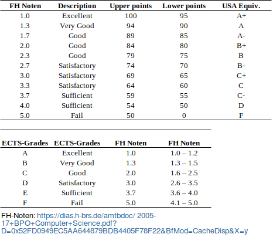
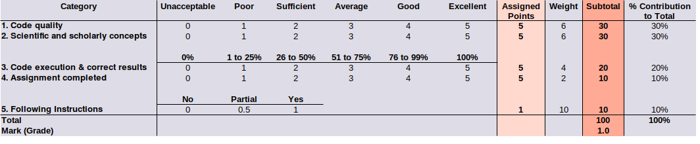

# Python_Grading_GUIs
Collection of grading schemes used in my courses.

All final scores are out of 100%. Marks (grades) are assigned according the to point distribution scheme shown in Figure 1.

   
  Figure 1. The distribution of marks according to points. This distribution scheme is followed by the University of Applied Sciences Bonn-Rhein-Sieg (https://www.h-brs.de/en).

##### Output:
1) Text files entitled using the student identifier
2) Prints to screen the resulting file content

##### Library Dependencies:
1) bisect
2) tkinter

##### Grading Schemes:
1) 01_rubric_v1

   
  Figure 2. The grading scheme for 01_rubric_v1. Points are assigned and then multiplied by their corresponding weighting factor to provide the resulting subtotal value.

##### Contact:
Karl N. Kirschner 
Department of Computer Science 
University of Applied Sciences Bonn-Rhein-Sieg 
Grantham-Allee 20 
53757 Sankt Augustin - Germany 

##### Contribution:
Concept, Coding and Structure: Kirschner 

 
